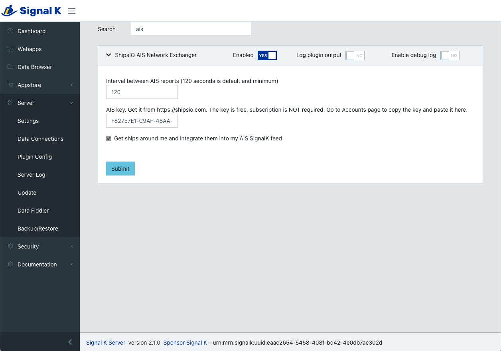

# shipsio-signalk-plugin
Signal K Node server plugin to exchange AIS vessel targets with ShipsIO.

Requires a key from ShipsIO. Get it free from https://shipsio.com/, no subscription required.
Just create an account with a valid e-mail and go to the Account page. Then copy the key and
go to the plugin config in SignalK and paste the key.

## Support

Contact team@shipsio.com

## SignalK Plugin
https://github.com/SignalK/signalk-server/blob/master/SERVERPLUGINS.md

## Configuration
